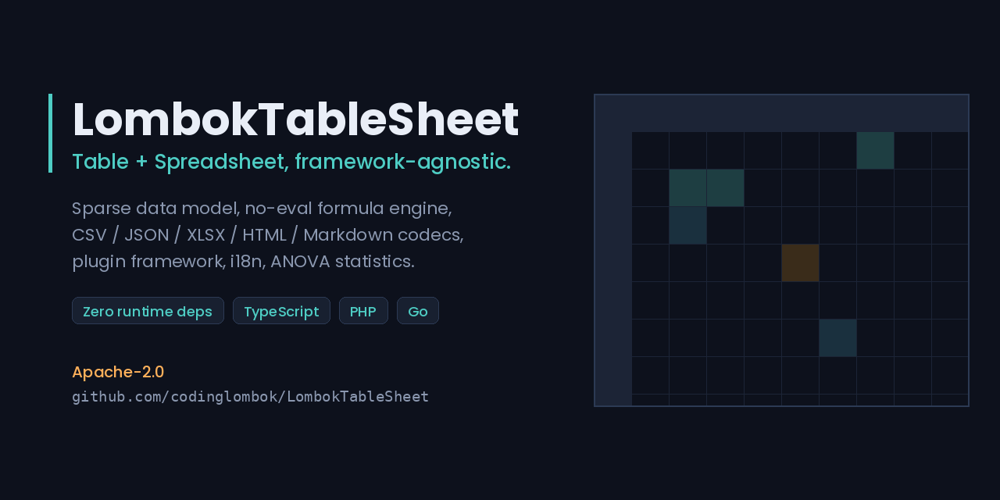
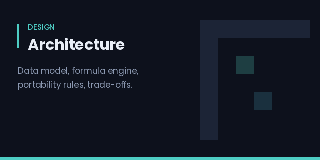
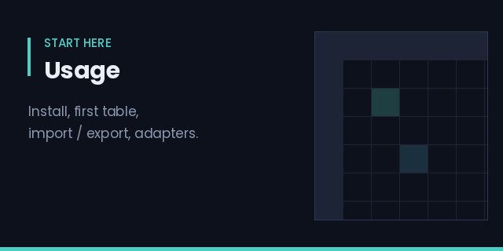
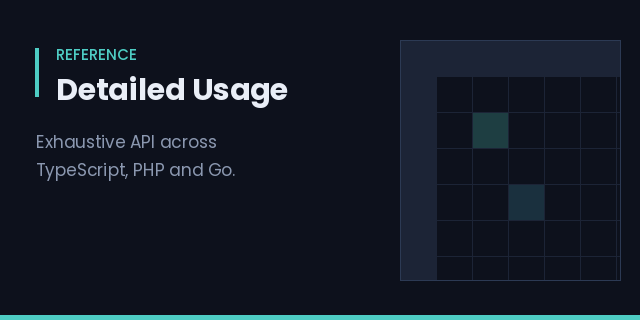
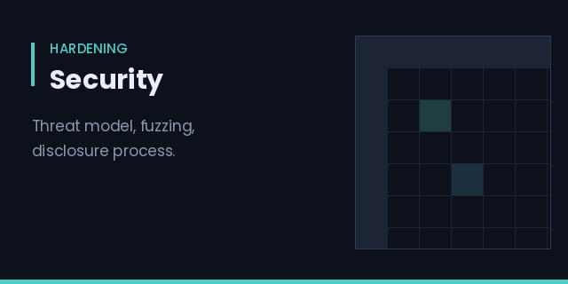
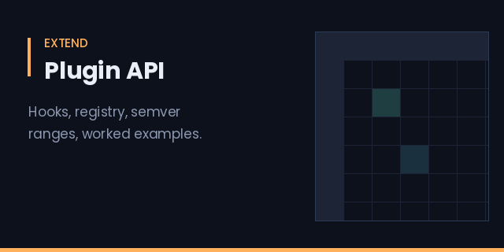
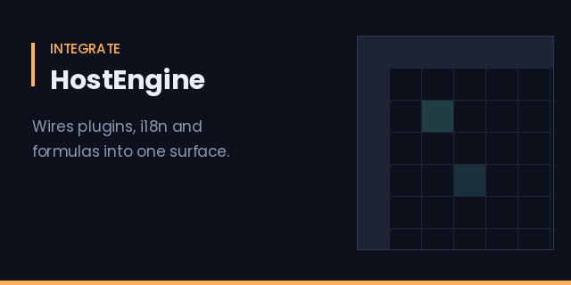

# LombokTableSheet

---

### GitHub

[](https://github.com/codinglombok/LombokTableSheet/actions/workflows/ci.yml)
[](https://github.com/codinglombok/LombokTableSheet/actions/workflows/php-ci.yml)
[](https://github.com/codinglombok/LombokTableSheet/actions/workflows/go-ci.yml)
[](https://github.com/codinglombok/LombokTableSheet/actions/workflows/linter.yml)
[](https://github.com/codinglombok/LombokTableSheet/actions/workflows/pages.yml)
[](LICENSE)

---

### NPM

[](https://www.npmjs.com/package/lomboktablesheet)
[](https://www.npmjs.com/package/lomboktablesheet)
[](https://www.jsdelivr.com/package/npm/lomboktablesheet)
[](#)
[](#)

> The npm badges above will read **not found** until the first publish. `v1.0.0` is the
> release intended to go out; see [DEPLOYMENT.md](./DEPLOYMENT.md). Everything else on
> this page is live today.

---

A Table + Spreadsheet library with a framework-agnostic core and thin adapters for
React, Vue, and vanilla JS. The core carries **no runtime dependencies** and is written
deliberately without `eval`, reflection, or host-language tricks — so the same design
ports mechanically to other languages rather than being rewritten per platform.

[](https://codinglombok.github.io/LombokTableSheet/)

|                                                                                |                                                                      |
| -------------------------------------------------------------------------------- | ---------------------------------------------------------------------- |
| [](./ARCHITECTURE.md)       | [](./USAGE.md)                  |
| [](./DETAILED_USAGE.md) | [](./SECURITY.md)         |
| [](./docs/PLUGIN_API.md)           | [](./docs/HOST_ENGINE.md) |

---

## Status — v1.0.0

| | |
|---|---|
| **TS/JS core** | 71 source files, ~4,500 lines · **252 tests passing** |
| **Formula engine** | Pratt parser, no `eval` anywhere on the evaluation path |
| **Codecs** | CSV · JSON · Markdown · XLSX · HTML · ZIP — all hand-written, no codec dependencies |
| **i18n** | 30-locale flat UI catalog, plus a namespaced manager with pluralization for 6 languages |
| **Plugins** | Registry, loader, semver range matching, 8 lifecycle hooks |
| **Statistics** | One-way and two-way ANOVA, cross-validated against SciPy and statsmodels |
| **PHP port** | [`ports/php`](./ports/php) — data/formula layer, 33 test methods, PHP 8.1–8.3 |
| **Go port** | [`ports/go`](./ports/go) — data/formula layer, 37 test functions, Go 1.21–1.22 |
| **CI/CD** | 13 workflows — see [WORKFLOWS.md](./WORKFLOWS.md) for what's automated and what honestly isn't |

Numbers under "TS/JS core" come from an actual test run, not an estimate. The PHP and Go
figures are counts of test methods/functions in those trees; they run in their own CI
workflows rather than in the TS suite.

**Known gaps, stated plainly:**

- **`ports/rust/` does not build.** Its `Cargo.toml` declares `src/lib.rs`, three test
  files, and an example that do not exist — the directory holds only `src/formula.rs`.
  Treat the Rust port as unstarted, not as a port in progress.
- **`npm run lint` is broken.** The script is `eslint src --ext .ts`, but ESLint 9
  removed `--ext` and requires a flat `eslint.config.js`, which this repo does not have.
  The `Linter` badge above will stay red until that is fixed properly.
- **XLSX, i18n, and the DOM adapters are TypeScript-only.** The PHP and Go ports cover
  the data and formula layers; they are not full ports.

## Install

```bash
npm install lomboktablesheet
```

Not published yet — until the first release lands, install straight from the repository:

```bash
npm install github:codinglombok/LombokTableSheet
```

PHP port (once on Packagist):

```bash
composer require codinglombok/lomboktablesheet
```

## Quick start

```ts
import { LombokTable, decodeCsv } from 'lomboktablesheet';

const { workbook } = decodeCsv('name,age\nAlice,30\nBob,25\n');
const table = new LombokTable(document.getElementById('app')!, {
  workbook,
  template: 'report',
  locale: 'en-US',
});
```

### Import / export

```ts
import {
  decodeCsv, encodeCsv, decodeJson, encodeJson, encodeMarkdown,
  decodeXlsx, encodeXlsx, decodeHtml, encodeHtml,
} from 'lomboktablesheet';

const { workbook, warnings } = decodeCsv(csvText);   // never throws — check `warnings`
const csvOut = encodeCsv(workbook);
const jsonOut = encodeJson(workbook);
const mdOut = encodeMarkdown(workbook);              // GitHub-flavored Markdown table

// XLSX: dependency-free — hand-written ZIP writer, no external xlsx library
const xlsxBuf = encodeXlsx(workbook);
const { workbook: fromXlsx } = decodeXlsx(xlsxBuf);

// HTML tables
const htmlOut = encodeHtml(workbook, { className: 'my-table' });
const { workbook: fromHtml } = decodeHtml('<table>...</table>');
```

### Split / merge

```ts
import { splitByRows, splitByColumns, splitBySheet, merge } from 'lomboktablesheet';

const [top, bottom] = splitByRows(workbook, 'Sheet1', 100);
const [left, right] = splitByColumns(workbook, 'Sheet1', 3);
const combined = merge([top, bottom], { onConflict: 'left-wins' });
```

### Editable spreadsheet + formulas

```ts
import { LombokSheet, Workbook } from 'lomboktablesheet';

const workbook = new Workbook('en-US');
const sheet = new LombokSheet(document.getElementById('app')!, { workbook });

sheet.on('cellChange', (row, col) => console.log('edited', row, col));
// Double-click a cell to edit. Type "=SUM(A1:A3)*2" — formulas recalculate when
// their dependencies change. Ctrl+Z / Ctrl+Y for undo/redo.
```

Supports `+ - * / ^`, comparisons, cell refs (`A1`) and ranges (`A1:B3`), and `SUM`,
`AVG`, `MIN`, `MAX`, `COUNT`, `IF`, `ROUND`, `CONCAT`. Failures become `#DIV/0!`,
`#CIRC!`, `#NAME?`, `#VALUE!` error cells rather than exceptions — see
[ARCHITECTURE.md](./ARCHITECTURE.md) §3.3/§6 for why there is no `eval` in the evaluator.

### Plugins

```ts
import { PluginRegistry, type IPlugin } from 'lomboktablesheet';

const registry = new PluginRegistry();
registry.register({
  name: '@acme/uppercase',
  version: '1.0.0',
  capabilities: ['formula-extension'],
  hooks: [{ hook: 'registerFormula', callback: () => ({
    name: 'UPPER', arity: 1, fn: (s: string) => String(s).toUpperCase(),
  }) }],
});
```

Dependencies between plugins are resolved with real semver ranges (`^`, `~`, `>=`, `<`,
conjunctions), and the registry refuses to unregister a plugin others still depend on.
Full reference: [docs/PLUGIN_API.md](./docs/PLUGIN_API.md) ·
[docs/PLUGIN_DEV_GUIDE.md](./docs/PLUGIN_DEV_GUIDE.md).

### HostEngine — plugins + i18n + formulas together

```ts
import { HostEngine, anovaPlugin, catalogs } from 'lomboktablesheet';

const engine = new HostEngine({ defaultLanguage: 'en' });
engine.registerLanguage('en', catalogs.en);
engine.registerLanguage('es', catalogs.es);
await engine.loadPlugin(anovaPlugin);

engine.listFormulaNames();               // ['ANOVA_ONEWAY', 'ANOVA_TWOWAY']
engine.evalFormula('ANOVA_ONEWAY', [23, 25, 21], [30, 32, 29], [28, 26, 30]);
```

Errors surface as `FormulaEngineError` with an already-localized `message`; the original
English, code-prefixed error stays on `.cause` for logs. See
[docs/HOST_ENGINE.md](./docs/HOST_ENGINE.md).

### Statistics

```ts
import { anovaOneWay, anovaTwoWay } from 'lomboktablesheet';

const r = anovaOneWay([[23, 25, 21], [30, 32, 29], [28, 26, 30]]);
r.f_statistic; r.p_value; r.eta_squared; r.significant;
```

Reference values and the scripts that generated them live in
[docs/anova/](./docs/anova/), so every expected number in the test suite is traceable to
SciPy or statsmodels output rather than to a previous run of this library.

### Templates

Built in: `plain`, `report`, `invoice`, `financial-statement`. Register your own:

```ts
import { defaultTemplates } from 'lomboktablesheet';

defaultTemplates.register({
  name: 'dashboard',
  description: 'Compact dashboard style',
  header: { bold: true, sticky: true },
  zebraRows: true,
  borders: 'horizontal',
  numberAlign: 'right',
  cssHooks: ['lts-dashboard'],
});
```

Templates are pure JSON/CSS and never couple to your data — export to CSV or JSON and the
presentation concerns disappear entirely.

### i18n

Two surfaces, deliberately separate:

```ts
import { I18n, I18nManager, catalogs } from 'lomboktablesheet';

// Intl-backed formatting + a flat UI-string catalog, 30 locales
const i18n = new I18n('ar-EG');
i18n.isRtl();                        // true
i18n.formatCurrency(1500, 'USD');

// Namespaced catalogs with pluralization, 6 languages
const m = new I18nManager({ defaultLanguage: 'de' });
m.registerLanguage('de', catalogs.de);
m.tp('plurals.row_count', 3);        // "3 Zeilen"
```

## Framework adapters

React and Vue are opt-in sub-paths — the core bundle contains no React or Vue code.

```tsx
// React
import { LombokTableReact, LombokSheetReact } from 'lomboktablesheet/react';

function App() {
  return <LombokTableReact data={rows} template="report" locale="en-US" />;
}
```

```vue
<!-- Vue 3 -->
<script setup>
import { LombokTableVue } from 'lomboktablesheet/vue';
</script>
<template>
  <LombokTableVue :workbook="workbook" template="invoice" />
</template>
```

Both wrappers mount the same framework-agnostic `LombokTable` / `LombokSheet` core
underneath — they are thin, not reimplementations.

## Optional peers

- [LombokCharts](https://github.com/codinglombok/LombokCharts) — chart rendering from the same `Workbook` data.
- [LombokCSS](https://github.com/codinglombok/LombokCSS) — themeable styling via the `cssHooks` that templates expose.

Both are optional `peerDependencies`; LombokTableSheet works standalone without them.

## Documentation

| Document | What's in it |
|---|---|
| [PROJECT_SUMMARY.md](./PROJECT_SUMMARY.md) | What exists, in numbers |
| [ARCHITECTURE.md](./ARCHITECTURE.md) | Design, data model, trade-offs, roadmap |
| [USAGE.md](./USAGE.md) | Quick how-to (TS + PHP) |
| [DETAILED_USAGE.md](./DETAILED_USAGE.md) | Exhaustive API reference, all ports |
| [docs/PLUGIN_API.md](./docs/PLUGIN_API.md) | Plugin interfaces and hooks |
| [docs/PLUGIN_DEV_GUIDE.md](./docs/PLUGIN_DEV_GUIDE.md) | Building a plugin, start to finish |
| [docs/HOST_ENGINE.md](./docs/HOST_ENGINE.md) | How plugins, i18n and formulas wire together |
| [SECURITY.md](./SECURITY.md) | Hardening record and disclosure process |
| [WORKFLOWS.md](./WORKFLOWS.md) | Every CI workflow, and the ones deliberately not built |
| [DEPLOYMENT.md](./DEPLOYMENT.md) | How to ship it |

## Development

```bash
npm install
npm run typecheck   # tsc --noEmit
npm test            # node --test — 252 tests
npm run build       # emits dist/ (ESM + type declarations)
```

The test suite runs on Node's built-in runner, not Jest. `tests/expect.ts` is a small
Jest-compatible assertion shim so suites written against the Jest API run unchanged —
add matchers there rather than introducing a test framework dependency.

README artwork is generated, not hand-drawn: `python3 docs/assets/generate_assets.py`.
Those are designed graphics rather than screenshots — real demo captures should come
from the Pages site once it is enabled.

## License

Apache 2.0 — see [LICENSE](./LICENSE).
